<div align="center">

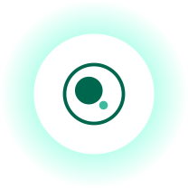

# Cura

**A Privacy-Focused Medical Records App**

Cura scans your lab reports, prescriptions, bills and discharge summaries, reads them
on the device, files them automatically, and lets you ask questions about your own
records in plain language.

No account. No server. No telemetry. By default, nothing leaves your phone.

[](LICENSE)


</div>

---

## What Cura is

Most people keep medical documents as a pile of paper, a folder of photos, or a
forgotten email attachment. When you actually need something ("what was my
hemoglobin last time", "how much did that surgery cost", "when was that scan"), it is
almost impossible to find.

Cura turns that pile into something you can search and question, without handing your
medical history to anyone.

**What it does**

- Reads a document with the camera or imports a PDF you already have.
- Pulls out the title, type, date and results table automatically.
- Files it into a searchable library and a chronological timeline.
- Rewrites a scraped report summary into plain prose in the background, after saving.
- Answers questions about your records, citing the reports the answer came from. Stop
  an answer mid-sentence, or long press your last question to copy or re-ask it.
- Exports any record, or your whole library, back out as a PDF.

**What it is for**

Keeping your own medical history in one place, understanding what a report says, and
finding a value or a date quickly. It is a personal organizer for documents you
already own.

**What it is not**

Cura is not a doctor. It does not diagnose, and it does not give medical advice. It
explains and organizes documents you already have.

---

## Install

Download the APK from the [Releases](../../releases) page.

**What you need**

| | |
|---|---|
| Android version | 8.0 (Oreo) or newer |
| Download | 58 MB |
| Free space | about 2 GB, since the AI model is fetched separately on first run |

Cura is not on the Play Store, so Android will ask permission before installing a file
from outside it. That prompt is normal for any APK.

1. Open the downloaded `.apk` from your notifications or Files app.
2. Android says installing from this source is blocked. Tap **Settings**, turn on
   **Allow from this source**, then go back.
3. Tap **Install**, then **Open**.

Setup then walks you through choosing where the AI runs, optional voice input, and an
optional app lock. Every step can be skipped.

<details>
<summary><b>Optional: check the download is genuine</b></summary>

<br>

Every release is signed with the same key, so you can confirm a file really came from
here and was not modified. Run this on the downloaded APK:

```bash
apksigner verify --print-certs Cura.apk
```

The SHA-256 it prints must be:

```
a7:de:64:b0:a4:45:44:f4:a3:16:5f:80:58:17:16:83:8d:b6:2c:d3:f9:d4:70:e9:bb:48:75:44:26:6c:97:53
```

If it does not match, the file was signed by someone else. Do not install it.

</details>

---

## Screenshots

### Setting up

The first run walks you through where AI should run, optional voice input, and an
optional app lock. Every step can be skipped.

| Welcome | Choose an engine | Cloud option |
|:---:|:---:|:---:|
| 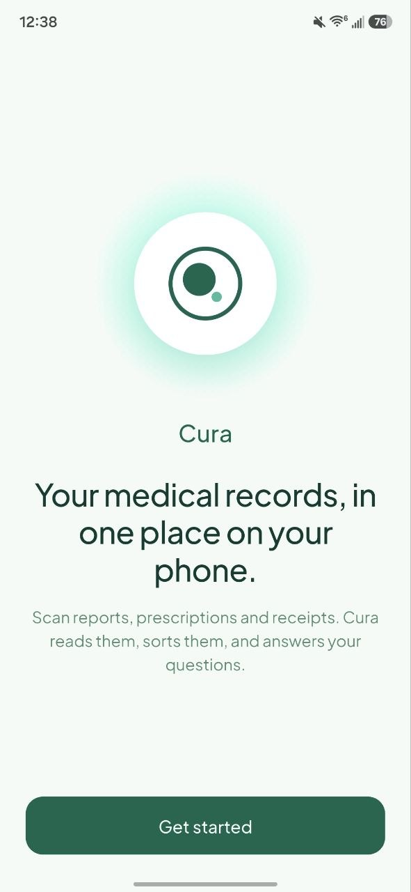 | 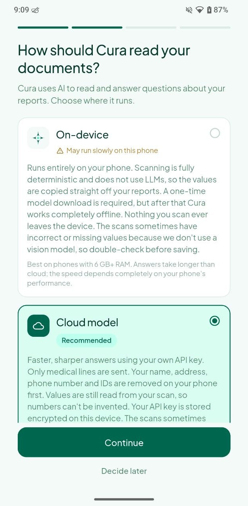 | 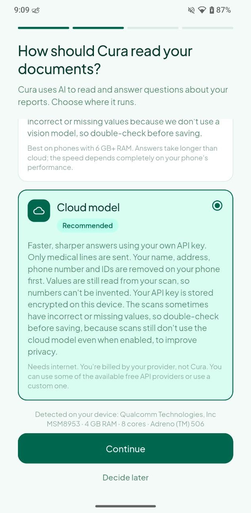 |
| Privacy promise and<br>a one tap start | On-device is explained in full,<br>with its real tradeoffs | The cloud option is opt in,<br>never the silent default |

| Download a model | Connect a provider | Voice input |
|:---:|:---:|:---:|
| 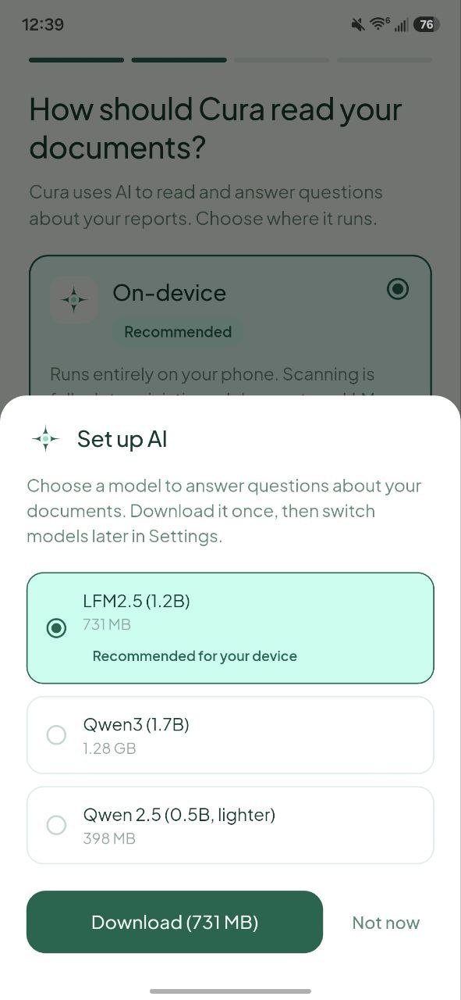 | 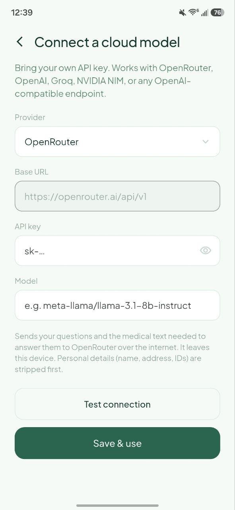 | 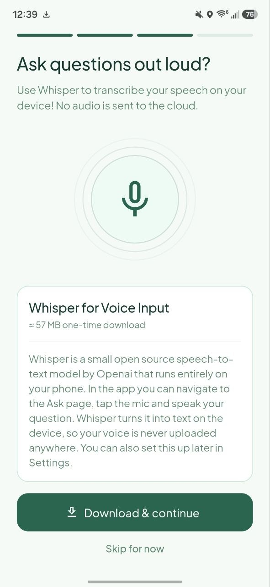 |
| One recommended for your phone,<br>the choice is still yours | Bring your own API key,<br>with a test button | Optional Whisper download<br>for speaking your questions |

| App lock |
|:---:|
| 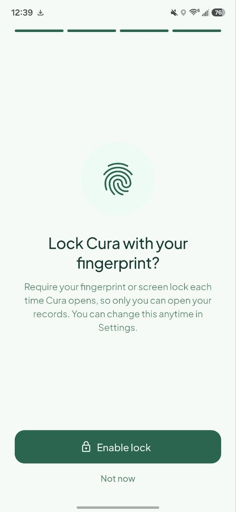 |
| Optional fingerprint or screen lock to open Cura |

### Using it

| Add a document | Your records | Timeline |
|:---:|:---:|:---:|
| 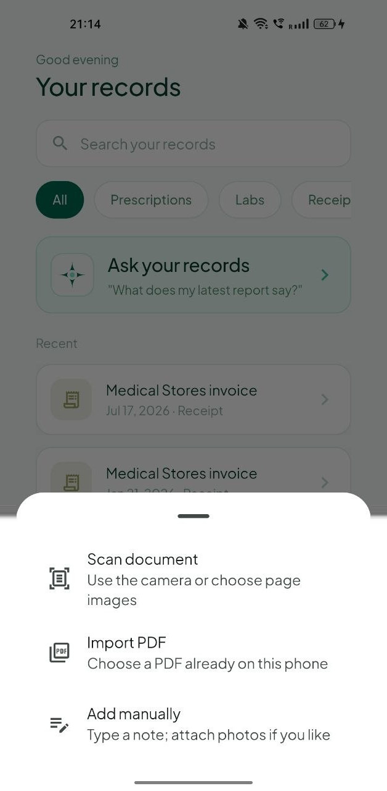 | 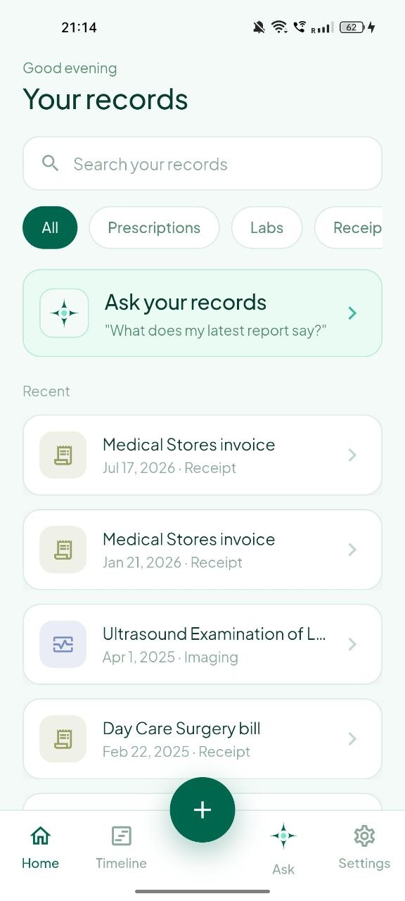 | 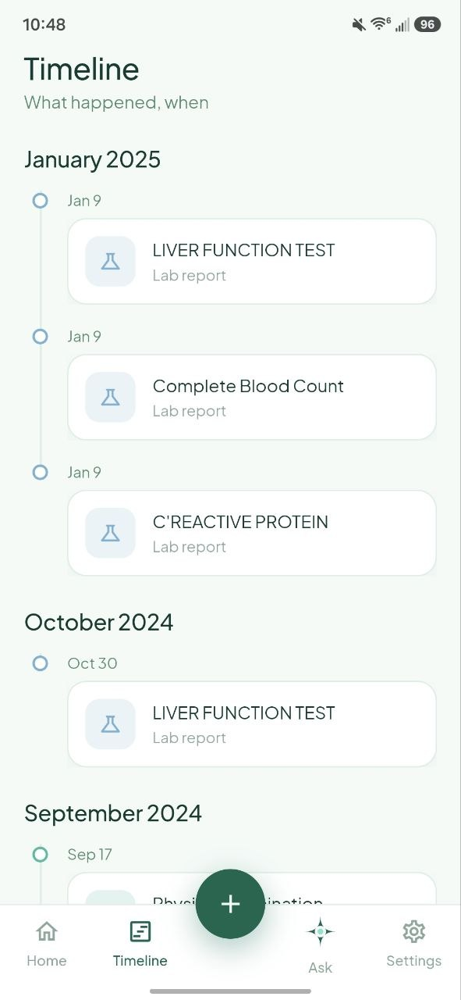 |
| Scan with the camera,<br>import a PDF, or type a note | Search and filter by type,<br>newest first | Everything in date order,<br>grouped by month |

| Ask | Settings | Models |
|:---:|:---:|:---:|
| 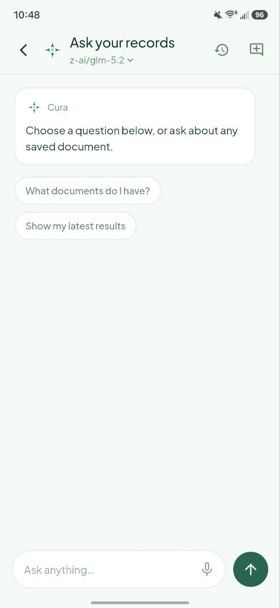 | 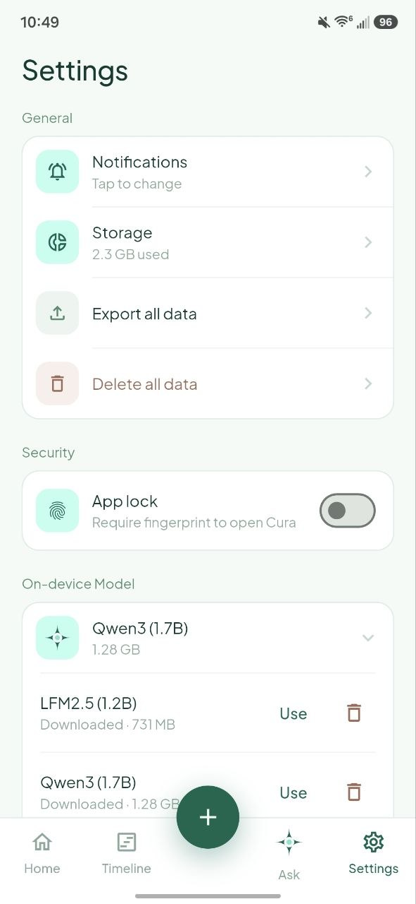 | 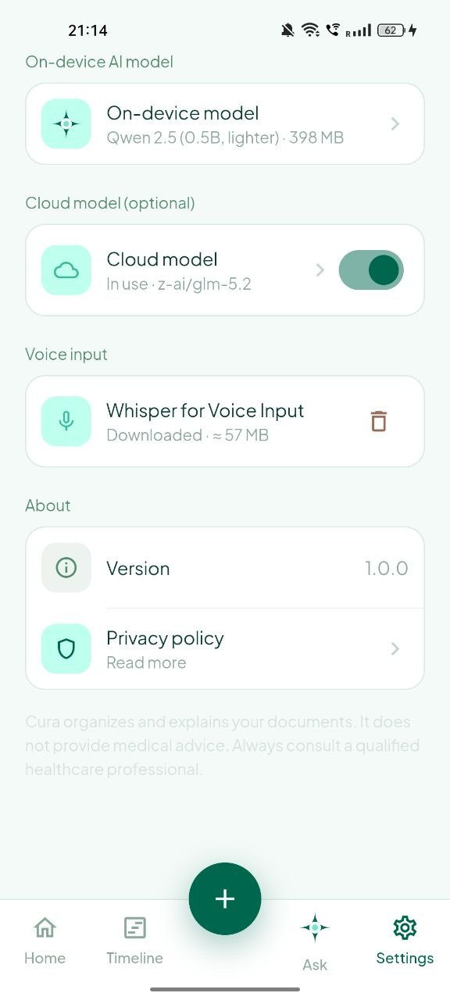 |
| Ask about your records,<br>answers cite their source | Data controls, app lock,<br>and engine settings | Switch or delete models,<br>see which engine is live |

| Storage |
|:---:|
| 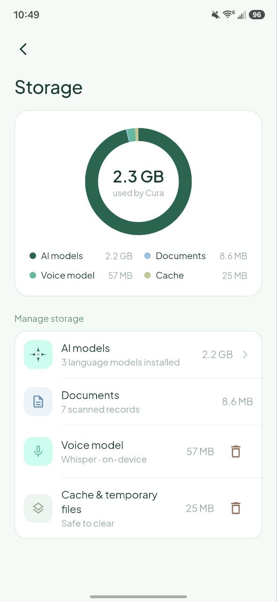 |
| See exactly what Cura is using on your phone |

---

## How scanning works, and why you must review it

This is the most important thing to understand about Cura.

**Scanning is deterministic. No AI model reads your values.** OCR recognizes the text
on the page, and the results table is rebuilt from the *geometry* of that text, which
number sits in which row and which column. Titles, document types and dates are
decided by rules. Amounts on bills come from the same geometry.

The upside is that a value in Cura is a value literally printed on your report. It
cannot be invented, because nothing is generating it.

> ### Please read before you trust a scan
>
> Because the reader is geometric and rule based, it depends on the page looking like
> a normal document. **Unusual, cramped, skewed, handwritten or multi column layouts
> can produce missing values, values attached to the wrong row, a wrong date, or a
> wrong title.**
>
> Cura always shows you a review screen before saving so you can fix or delete
> anything that came out wrong. **Check the values against the original document
> every time before you save.** Treat the paper report, not Cura, as the source of
> truth.

---

## The on-device engine (default)

Everything runs locally: OCR, parsing, storage, search, and AI answers. There is no
server and no account.

**What you download.** A language model is fetched once, then never again. Three open
GGUF builds are offered, quantized Q4_K_M, all requiring no login or token:

| Model | Size |
|---|---|
| LFM2.5 1.2B Instruct | 731 MB |
| Qwen3 1.7B | 1.28 GB |
| Qwen 2.5 0.5B Instruct (lighter) | 398 MB |

Onboarding measures your phone's RAM and cores and recommends one, but the choice is
always yours. Models can be switched or deleted later in Settings.

**Where the model actually runs.** Mostly it does not. Counts, latest values, dates
and lists are answered directly from the stored fields with no model at all, which is
why those answers are instant. The language model only runs for reasoning, summaries
and definitions.

**During scanning**, the on-device model is used for exactly one thing: on a receipt
or bill, it may suggest a **title** and a **purpose note**. Nothing else. Lab values,
prescriptions, dates and amounts stay fully deterministic.

**After saving**, it does one more thing. An imaging, discharge, visit or prescription
summary is scraped straight off the page, section by section, so it is accurate but
reads like a dump. Once you save the record, the model rewrites it into plain prose in
the background. Open the document before it finishes and you see the original with a
"Rewriting" note beside it. The scraped text is never overwritten: it is what Ask
searches and quotes, and the rewrite is display only, so a rewrite that drops a detail
costs you nothing. Any number in the rewrite that is not on the original page is thrown
away.

**Tradeoffs, honestly.** Answers are slower than cloud, and the speed depends entirely
on your phone. It works best on devices with 6 GB or more of RAM.

**Network use.** The one-time model download, and nothing else. Your documents never
leave the device.

---

## The cloud model (optional, off by default)

Some phones are too slow to run a language model comfortably. For those users, Cura
can talk to any OpenAI-compatible provider using **your own API key**.

This is **off by default**, requires a one-time explicit consent, and once it is on,
the privacy text in Settings changes to say so. The app never claims to be fully
offline while it is not.

### Providers

Presets are built in for the following, and any other OpenAI-compatible endpoint can
be added with a custom base URL:

| Provider | Base URL |
|---|---|
| OpenRouter (default) | `https://openrouter.ai/api/v1` |
| OpenAI | `https://api.openai.com/v1` |
| Groq | `https://api.groq.com/openai/v1` |
| NVIDIA NIM | `https://integrate.api.nvidia.com/v1` |
| Custom | any OpenAI-compatible base URL |

**Free options.** You do not have to pay to use this. Several of these providers
offer free access at the time of writing: OpenRouter lists a number of free models,
and Groq and NVIDIA NIM both offer free tiers. You are billed by whichever provider
you choose, never by Cura. Cura takes no cut and has no API key of its own.

**Your key.** It is stored in encrypted storage backed by the Android Keystore, using
`flutter_secure_storage`, never in plain preferences. There is a test connection
button so you can verify a key before saving it.

### Exactly where the cloud model is used after scanning

Cloud involvement in scanning is deliberately narrow, and it never produces your
numbers.

| Document type | With cloud enabled, the model may set |
|---|---|
| Prescription | nothing, never sent, fully deterministic |
| Visit note (typed by you) | nothing, never sent, fully deterministic |
| Receipt or bill | title, purpose note |
| Lab, imaging, discharge summary | type, date, title |
| Lab report only | the results table, **and only** when the OCR geometry was ambiguous and can be reconciled |
| Imaging, discharge, visit, prescription | after saving, the summary is rewritten for readability, from the scraped clinical sections only |

Everything else stays deterministic: lab values, prescription contents, and bill
amounts. The narrative summary is deterministic where it counts: the scraped text is
stored verbatim and is what Ask searches and quotes. Only the copy you read on the
document page is rewritten.

Even in the rare table repair case, the answer is not trusted blindly. Every value
that comes back is re-checked against the original OCR text before it is stored, so a
remote model cannot invent, alter or round a measurement.

### What is actually sent

Before any request leaves the phone, Cura minimizes it:

1. **An allowlist filter runs first.** Only lines carrying a medical signal are kept:
   a value with a unit, a reference range, a verdict, a section heading, a procedure,
   the report title, or the report date. Everything else is dropped as a block, which
   removes the letterhead, the patient details block and the footer in one go. That is
   where names, addresses, hospital IDs and phone numbers live, so they are removed no
   matter how they happen to be worded.
2. **A second pass scrubs whatever survived**, by keyword and by structure.
3. **Questions in Ask** are sent with structured fields only, meaning the title,
   results and note. The raw OCR text of the page is never sent.
4. **A summary rewrite** sends the scraped clinical sections and nothing else. No
   question you typed, no chat history, no page text. If the filter strips it to
   nothing, the request is abandoned rather than widened.

On-device is never redacted, because nothing leaves the phone, and your stored
documents always keep their full text.

---

## Voice input (optional)

Ask can listen instead of making you type. Cura downloads Whisper, a small open
source speech to text model, once, about 57 MB. Transcription happens on the phone,
so your audio is never uploaded, and the microphone only opens while you are actually
speaking. It can be skipped during setup and enabled later in Settings, or deleted
to reclaim the space.

## App lock (optional)

Because Cura holds your medical history, you can require a fingerprint, face unlock,
or your device PIN or pattern before the app will open. It is off by default, can be
toggled in Settings, and also hides your records in the app switcher preview. If you
later remove every screen lock from your phone, Cura lets you in rather than locking
you out of your own records.

## Your data stays yours

- **Export** any single record or your entire library as a PDF.
- **Delete** any record, or wipe everything, from Settings.
- **See** exactly what is stored, broken down by models, documents, voice model and
  cache, and clear the cache at any time.
- Documents live in the app's private storage. Uninstalling Cura removes them.

---

## Tech stack

| Area | Choice |
|---|---|
| App | Flutter, Android first, Dart `^3.12.2` |
| State | Riverpod |
| Database | Drift (SQLite) |
| OCR | `google_mlkit_document_scanner`, `google_mlkit_text_recognition`, bundled and offline |
| On-device LLM | `llama_flutter_android` (llama.cpp, GGUF, CPU, ARM64) |
| Speech to text | `whisper_ggml` (whisper.cpp) |
| Optional cloud | any OpenAI-compatible endpoint over `http` |
| Secrets | `flutter_secure_storage` (Android Keystore) |
| PDF | `pdf`, pure Dart and fully offline |
| Font | Plus Jakarta Sans, bundled locally so there is no runtime font fetch |

## Build it yourself

You need the [Flutter SDK](https://docs.flutter.dev/get-started/install), the Android
SDK, and JDK 17. `flutter doctor` tells you if anything is missing.

```bash
git clone https://github.com/Tarun-032/Cura.git
cd Cura
flutter pub get
flutter run                  # debug build on a connected phone
```

That is the whole setup. There is no API key to configure, no `.env` file, no backend to
run. A cloud key, if you want one, is entered in the app at runtime and never touches
the repository.

Other useful commands:

```bash
flutter analyze              # static analysis
flutter test                 # unit and widget tests
flutter build apk --release  # the installable APK
```

**Use a real phone, not an emulator.** The AI model is compiled for ARM64, so it will
not load on an x86 emulator. Everything else works there, but nothing AI-related will.

**Signing.** Release builds here are signed with a private key that is not in this
repository. Building from source without it just works: Gradle falls back to your own
debug key automatically, so `flutter build apk --release` needs no extra setup from a
fresh clone. Your build simply carries your signature instead of the official one.

**Code generation.** The database layer is generated. If you change a table in
`lib/core/data/app_database.dart`, regenerate it:

```bash
dart run build_runner build
```

## How the project is organised

Everything lives under `lib/`, split by feature rather than by layer, so one folder
holds the screen, its state and its logic together.

```
lib/
  app/theme/       colours, typography, the Material 3 theme
  core/data/       the SQLite schema and the repositories that read it
  core/widgets/    small widgets shared across features
  features/
    onboarding/    first run: engine choice, voice, app lock
    scan/          camera, OCR, and the rule-based parsers that read a page
    library/       the records list, search, and a single document's page
    timeline/      the same records in date order
    ask/           the chat screen and its saved conversations
    ai/            answering questions: retrieval, the local model, and
                   remote/ for the optional cloud engine and its PII filters
    export/        writing records back out as PDF
    pdf_import/    reading a PDF you already have
    security/      the biometric app lock
    settings/      storage, models, engine, and data controls
test/              unit and widget tests, one file per area
```

Two folders carry most of the weight. **`scan/`** is where a photo becomes a record, and
it is deliberately free of AI: OCR reads the text, and rules and table geometry do the
rest. **`ai/remote/`** is the boundary the cloud engine has to cross, and it is where
every piece of personal information is stripped before a request can leave the phone.

## Acknowledgements

- [llama.cpp](https://github.com/ggml-org/llama.cpp) and
  [whisper.cpp](https://github.com/ggml-org/whisper.cpp) by Georgi Gerganov and
  contributors
- Google [ML Kit](https://developers.google.com/ml-kit) for on-device OCR
- GGUF quantizations by [bartowski](https://huggingface.co/bartowski) and
  [LiquidAI](https://huggingface.co/LiquidAI)
- [Plus Jakarta Sans](https://github.com/tokotype/PlusJakartaSans) by Tokotype, under
  the SIL Open Font License 1.1, see
  [`assets/fonts/OFL.txt`](assets/fonts/OFL.txt)
- [Drift](https://drift.simonbinder.eu/) and [Riverpod](https://riverpod.dev/)

## License

Apache 2.0, see [LICENSE](LICENSE) and [NOTICE](NOTICE). The bundled font is licensed
separately under the SIL OFL 1.1.

## Disclaimer

Cura organizes and explains your own documents. **It does not provide medical advice
and it does not diagnose.** Extracted values can be wrong, especially on unusual
layouts, so always review a scan before saving it. Always consult a qualified
healthcare professional, and treat the original document as the source of truth.
